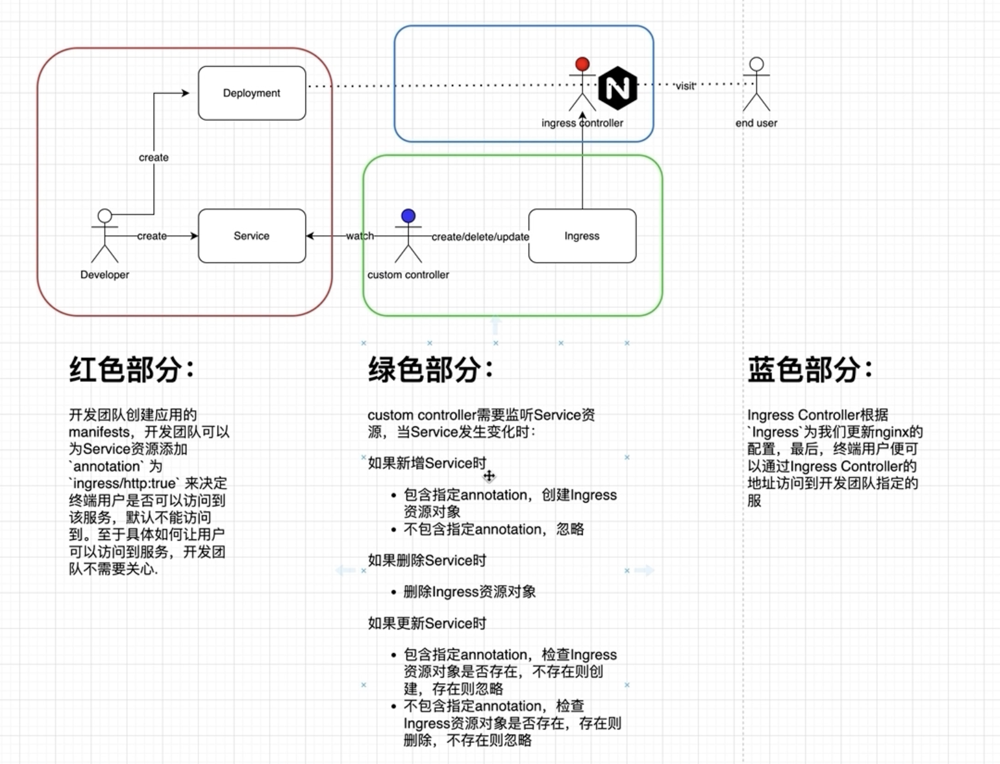

## Create Ingress
```
kubectl apply -f https://raw.githubusercontent.com/kubernetes/ingress-nginx/controller-v1.1.2/deploy/static/provider/cloud/deploy.yaml
```

## Application to Service
```
https://kubernetes.io/zh/docs/concepts/services-networking/connect-applications-service/
```

## Test Flow
